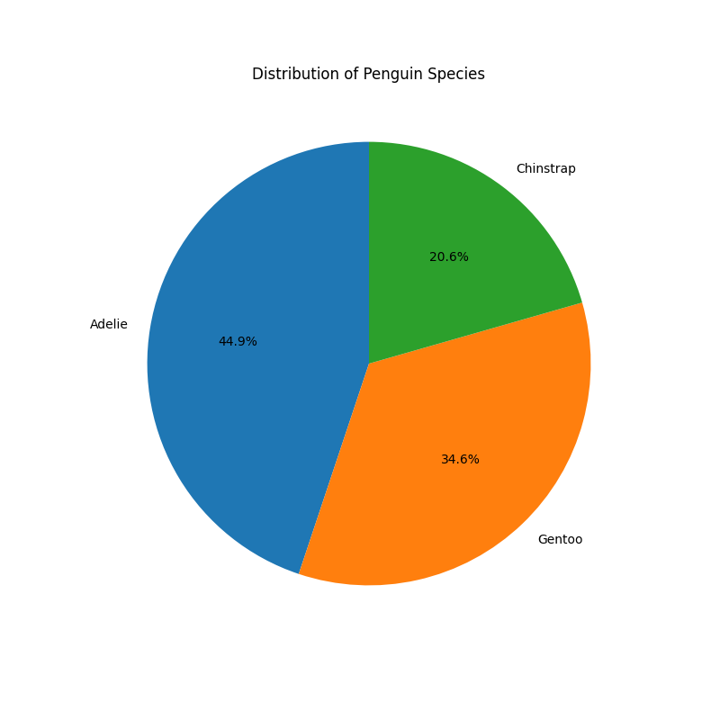
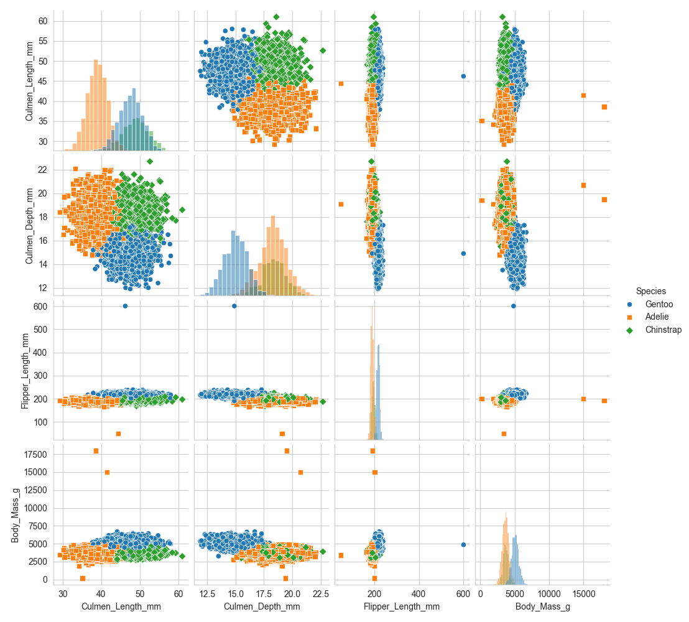
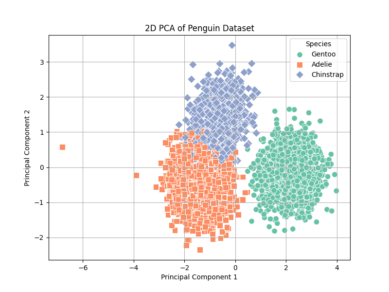

## 数据的预处理与特征工程
### （1）数据探索
#### ①数量统计与饼图
对原始表`Speices`进行统计：
|物种|样本数量|占比|
|---|---|---|
|Adelie|2239|44.9%|
|Gentoo|1725|34.6%|
|Chinstrap|1026|20.6%|

代码：[class_distribution.py](class_distribution.py)。
#### ②散点图矩阵绘制
**剔除NaN项：** 利用`dropna`移除四列特征中有任何缺失的整行，保留4509行。

代码：[pairplot.py](pairplot.py)。

**结论：** 
- **嘴峰长度、深度** 对于区分**Adelie**和**Chinstrap**十分有效，两者的重叠度很低；
- **脚蹼长度、体重** 更有利于区分目标是否为**Gentoo**，其余两类在这两个维度上有较高的重叠。

### （2）缺失值与异常值清洗
#### ①定位缺失值
|特征|缺失计数|缺失占比|
|---|---|---|
|嘴峰长度|249|5.0%|
|体重|249|5.0%|
|性别|149|3.0%|

#### ②数据填补策略
**嘴峰长度、体重：** 连续型数据，选用**中位数**填补，比均值更稳健，不受异常值影响；
**性别：** 离散型数据，选用**众数**填补，原数据损失率较高，不宜直接剔除。
**Flipper_Length_mm** 用中位数 `196.9` 填补缺失值；
**Body_Mass_g** 用中位数 `4012.0` 填补缺失值；
**Sex** 用众数 `MALE` 填补缺失值。

#### ③异常值剔除
设置保留阈值：
`Body_Mass_g <= 10000`
`Flipper_Length_mm <= 300`
清洗后剩余数据4987条。
代码：[data_cleaning.py](data_cleaning.py)；
结果为[cleaned_penguin_data.csv](./cleaned_penguin_data.csv)。
### （3）特征编码与标准化
#### ①对类别型特征使用独热编码
对`Island`、`Sex`做独热编码，代码：[one_hot_encode.py](one_hot_encode.py)；
结果为[ecoded_penguin_data.csv](./ecoded_penguin_data.csv)。
#### ②Z-score规范化
对`Culmen_Length_mm` `Culmen_Depth_mm` `Flipper_Length_mm` `Body_Mass_g`进行Z-score规范化。
代码：[z_score_scale.py](z_score_scale.py)；
结果为[scaled_penguin_data.csv](./scaled_penguin_data.csv)。

### 降维与流形可视化
#### ①对处理后的高维特征进行PCA降维，提取出PC1和PC2
#### ②绘制2D散点图并观察

代码：[pca.py](pca.py)；
解释方差比分别约为55.51%和15.88%，合计约71.38%。
**结论：**
- Gentoo在二维空间中已经形成较为独立的聚类簇，证明我们给出的两个维度基本能够完成对Gentoo的分类任务；
- Adelie和Chinstrap依旧存在一定的重叠部分，采用给出的维度进行分类有一定的概率出现错误，可能需要更多主成分或者非线性模型。
- 总体来说，观察三个企鹅物种在二维空间中基本形成了清晰的聚类簇，为实验二的分类可行性提供一定的视觉依据。
